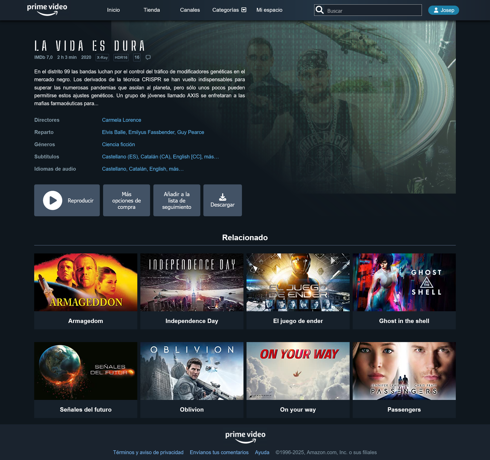

# Projecte Amazone Prime Clone

## Instruccions

A partir del disseny proposat realitza la pàgina web seguint els requeriments:

- Crea l’estructura de directoris del projecte i l’estructura principal de la pàgina emprant les etiquetes semàntiques corresponents.
- Inclou icones de la llibreria __font awesome__ (icones cerca, usuari, reproducció video...)
- Baixa la font de google 'Big Shoulders Stencil Text' i aplica-la al títol de la pel·lícula.
- Crea la capçalera fixe a la part superior.
- Crea un submenú contextual al ítem categoria
- Crea la secció de la informació de la pel·lícula (alineació dels botons amb flexbox)
- Codifica la secció de la galeria de pel·lícules relacionades usant CSS grid.
- Crea el peu de pàgina amb el menú corresponent.
- Puja el projecte a GitHub i publica a netlify


## Dades i estils de la web

### Text central
> En el distrito 99 las bandas luchan por el control del tráfico de modificadores genéticas en el mercado negro. Los derivados de la técnica CRISPR se han vuelto indispensables para superar las numerosas pandemias que asolan al planeta, pero sólo unos pocos pueden permitirse estos ajustes genéticos. Un grupo de jóvenes llamado AXIS se enfretaran a las mafias farmacéuticas para... 

### CSS 
- Gradient per superposar a l'imatge central
```css
  background: linear-gradient(
    38deg,
    rgba(15, 23, 30, 1) 0%,
    rgba(15, 23, 30, 1) 41%,
    rgba(255, 255, 255, 0) 100%
  );
```

- Gradient del header (opcial)
```css
  background: linear-gradient(90deg,
  rgba(26, 35, 46, 1) 0%,
  rgba(25, 36, 46, 1) 29%,
  rgba(35, 52, 68, 1) 66%,
  rgba(26, 35, 46, 1) 100%
);
```

## Screenshots



